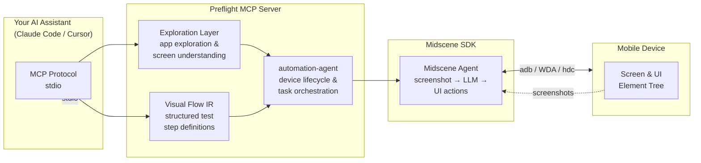

# Preflight

> **Give your coding AI a real phone to test on.**

Preflight is an MCP (Model Context Protocol) server that connects AI coding assistants (Claude Code, Cursor, Codex) to real Android, iOS, and HarmonyOS devices for interactive testing — entirely on your local machine.

<p align="center">
  
</p>

## Setup

### Prerequisites

| Dependency | Required for | Notes |
|-----------|-------------|-------|
| **Node.js** ≥ 20.11 | All platforms | Install via [nvm](https://github.com/nvm-sh/nvm) or [nodejs.org](https://nodejs.org/) |
| **adb** | Android | Ship with Android SDK / [platform-tools](https://developer.android.com/studio/releases/platform-tools). Ensure `adb` is on your `PATH`, or set `ADB_BINARY_PATH` in config. |
| **Xcode** + **iproxy** | iOS | Xcode from [Mac App Store](https://apps.apple.com/app/xcode/id497799835). `iproxy` ships with `brew install libimobiledevice`. |
| **WebDriverAgent** | iOS | [Facebook WebDriverAgent](https://github.com/facebook/WebDriverAgent) — build and deploy to your device from Xcode. Set `WDA_PROJECT_ROOT` in config to point at your local copy. |
| **hdc** | HarmonyOS | Ships with [DevEco Studio](https://developer.huawei.com/consumer/cn/deveco-studio/). Ensure `hdc` is on your `PATH`. |
| **AI model API key** | All platforms | A [Midscene](https://midscenejs.com/)-compatible vision model. Supports OpenAI, Anthropic, Doubao, and more. |

### 1. One-command setup

```bash
npm run mcp:setup
```

This creates `~/.preflight/runtime/` with a bundled Node.js and all compiled assets, then registers the `Preflight` MCP server in your editor's config (`.cursor/mcp.json` or `~/.codex/config.toml`).

### 2. Configure your AI model

Create `~/.preflight/config.json`:

```json
{
  "env": {
    "MIDSCENE_MODEL_BASE_URL": "https://ark.cn-beijing.volces.com/api/v3",
    "MIDSCENE_MODEL_API_KEY": "sk-xxxxxxxxxxxxxxxx",
    "MIDSCENE_MODEL_NAME": "doubao-seed-2-0-lite-260215",
    "MIDSCENE_MODEL_FAMILY": "doubao-seed"
  }
}
```

**Supported providers** — any of these works:

| Provider | `MIDSCENE_MODEL_BASE_URL` | `MIDSCENE_MODEL_NAME` |
|----------|--------------------------|-----------------------|
| OpenAI | `https://api.openai.com/v1` | `gpt-4o` |
| Anthropic | `https://api.anthropic.com/v1` | `claude-sonnet-4-20250514` |
| Doubao (Volcengine) | `https://ark.cn-beijing.volces.com/api/v3` | `doubao-seed-2-0-lite-260215` |

You can also set standard env vars (`OPENAI_API_KEY`, `ANTHROPIC_API_KEY`, etc.) — Preflight picks them up automatically.

### (Optional) iOS WebDriverAgent

iOS testing requires [WebDriverAgent](https://github.com/facebook/WebDriverAgent) running on your device:

```bash
git clone https://github.com/facebook/WebDriverAgent.git
cd WebDriverAgent
./Scripts/bootstrap.sh
open WebDriverAgent.xcodeproj
```

Build the `WebDriverAgentRunner` scheme targeting your device. Then add to `~/.preflight/config.json`:

```json
{
  "env": {
    "WDA_PROJECT_ROOT": "/path/to/WebDriverAgent",
    "WDA_SCHEME": "WebDriverAgentRunner"
  }
}
```

### 4. Restart and test

Restart your AI coding assistant. Now you can say things like:

> *"Check my devices, explore the Notes app, and write a test for creating a new note."*

The AI calls `list_devices` → `exploration_start` → explores your app naturally → generates and runs a visual-flow test on the real device.

## How It Uses Midscene

[**Midscene**](https://midscenejs.com/) is the visual AI engine that powers Preflight's ability to see and act on mobile screens. It works by feeding screenshots and structured instructions to a multimodal LLM, then parsing the model's response into concrete UI actions.

Preflight wraps Midscene in three layers:



**How the layers work together:**

1. **Exploration Layer** — Your AI assistant uses natural-language tools (`exploration_get_page_summary`, `exploration_ai_act`) to understand the app, navigate screens, and decide what to test.
2. **Visual Flow IR** — Once the flow is understood, it's captured as a structured JSON — a sequence of steps with assertions, free of fragile selectors or coordinates.
3. **Midscene SDK** — Each step is compiled into a Midscene plan: the SDK takes a screenshot, sends it with instructions to the vision model, and performs the returned action (tap, type, swipe, assert) on the device via adb/WDA/hdc.

This design means tests survive UI reshuffles (Midscene targets *what* to interact with, not *where*), and the AI never needs to write fragile XPath or accessibility-id selectors.

## Tools Overview

| Category | Tools |
|----------|-------|
| **Agent** | `agent_health` · `start_agent` · `stop_agent` · `doctor` · `config_status` |
| **Device** | `list_devices` · `install_app` |
| **Exploration** | `exploration_start` · `exploration_end` · `exploration_get_page_summary` · `exploration_ai_act` · `exploration_ask_about_screen` · `exploration_screenshot` · `exploration_type` · `exploration_wait` |
| **Visual-Flow** | `get_visual_flow_ir_rules` · `validate_visual_flow` · `run_flow` · `watch_run` · `cancel_run` · `save_report` · `read_report` |

## License

[Apache 2.0](./LICENSE)
