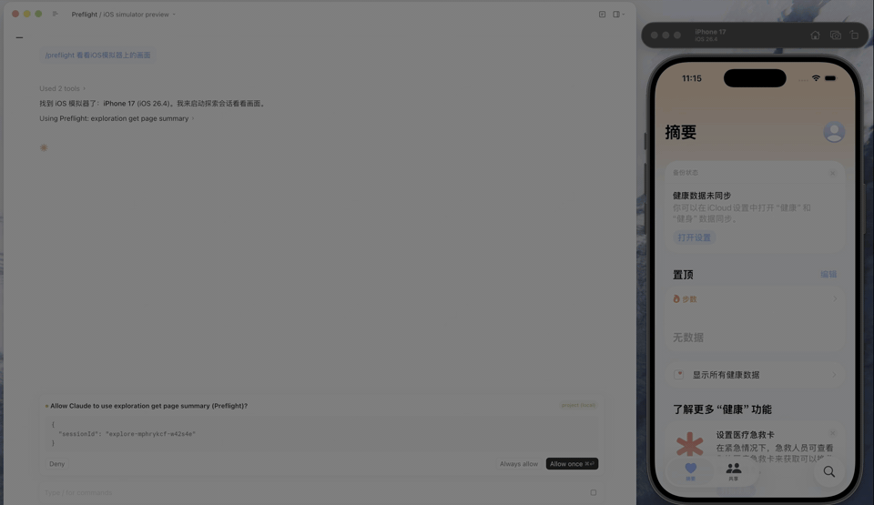
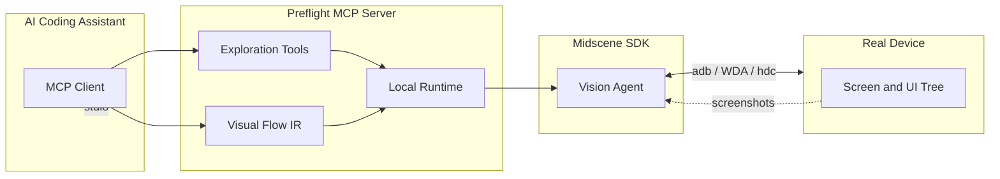

# Preflight

Local MCP server for testing mobile apps on real Android, iOS, and HarmonyOS devices with AI coding assistants.

[](https://www.npmjs.com/package/preflite)
[](./LICENSE)
[](https://github.com/zifengjiang/Preflight/actions/workflows/release.yml)

Preflight gives Claude Code, Cursor, Codex, and other MCP clients a real mobile device to inspect, operate, and test. It turns natural-language testing requests into structured visual-flow runs with live viewing, screenshots, and saved reports.

<p align="center">
  
</p>

## Why Preflight?

- Test on real devices instead of mocked browser views or screenshots.
- Let coding agents inspect screens, tap, type, swipe, wait, and assert UI state.
- Generate visual-flow tests without fragile XPath selectors, accessibility-id assumptions, or fixed coordinates.
- Keep the runtime local: devices, reports, configuration, and the MCP server stay on your machine.
- Use the same workflow across Android, iOS, and HarmonyOS.

## Quick Start

Install the local runtime and register the MCP server:

```bash
npx -y preflite@latest setup
```

This installs the packaged runtime under `~/.preflight/runtime`, writes a Preflight MCP entry for Codex (`~/.codex/config.toml`), and writes a Cursor project entry when you run it inside a repository (`.cursor/mcp.json`).

Create `~/.preflight/config.json` with a Midscene-compatible vision model:

```json
{
  "env": {
    "MIDSCENE_MODEL_BASE_URL": "https://ark.cn-beijing.volces.com/api/v3",
    "MIDSCENE_MODEL_API_KEY": "sk-xxxxxxxxxxxxxxxx",
    "MIDSCENE_MODEL_NAME": "doubao-seed-2-0-lite-260215",
    "MIDSCENE_MODEL_FAMILY": "doubao-seed",
    "MIDSCENE_MODEL_REASONING_ENABLED": "false"
  }
}
```

Restart your AI coding assistant, then ask it to use Preflight:

> Check my connected devices and run a smoke test on the app.

## What You Can Ask

Once the MCP server is available, your coding agent can work with real devices through requests like:

- "List my connected Android and iOS devices."
- "Open the app and verify the login flow."
- "Explore the settings screen and turn it into a visual-flow test."
- "Install this APK and run a smoke test."
- "Run the flow, watch it live, and save the report."

## Requirements

| Dependency | Required for | Notes |
|-----------|-------------|-------|
| Node.js >= 20.11 | All platforms | Install via [nvm](https://github.com/nvm-sh/nvm) or [nodejs.org](https://nodejs.org/). |
| AI model API key | All platforms | Any [Midscene](https://midscenejs.com/)-compatible vision model. |
| adb | Android | Ships with Android SDK [platform-tools](https://developer.android.com/studio/releases/platform-tools). Ensure `adb` is on your `PATH`, or set `ADB_BINARY_PATH`. |
| Xcode + iproxy | iOS | Xcode from the [Mac App Store](https://apps.apple.com/app/xcode/id497799835). `iproxy` ships with `brew install libimobiledevice`. |
| WebDriverAgent | iOS | Build and deploy [WebDriverAgent](https://github.com/facebook/WebDriverAgent) to your device, then set `WDA_PROJECT_ROOT`. |
| hdc | HarmonyOS | Ships with [DevEco Studio](https://developer.huawei.com/consumer/cn/deveco-studio/). Ensure `hdc` is on your `PATH`. |

## Model Configuration

Preflight loads model configuration from `~/.preflight/config.json`, `~/.preflight/config.yaml`, or `~/.preflight/config.yml`. You can also rely on standard provider environment variables such as `OPENAI_API_KEY` or `ANTHROPIC_API_KEY`.

| Provider | `MIDSCENE_MODEL_BASE_URL` | Example `MIDSCENE_MODEL_NAME` |
|----------|--------------------------|-------------------------------|
| OpenAI | `https://api.openai.com/v1` | `gpt-4o` |
| Anthropic | `https://api.anthropic.com/v1` | `claude-sonnet-4-20250514` |
| Doubao / Volcengine | `https://ark.cn-beijing.volces.com/api/v3` | `doubao-seed-2-0-lite-260215` |

## iOS Setup

iOS testing requires WebDriverAgent running on your device:

```bash
git clone https://github.com/facebook/WebDriverAgent.git
cd WebDriverAgent
./Scripts/bootstrap.sh
open WebDriverAgent.xcodeproj
```

Build the `WebDriverAgentRunner` scheme targeting your device. Then add the project path to `~/.preflight/config.json`:

```json
{
  "env": {
    "WDA_PROJECT_ROOT": "/path/to/WebDriverAgent",
    "WDA_SCHEME": "WebDriverAgentRunner"
  }
}
```

## How It Works

Preflight connects your AI assistant to local device automation through MCP. The assistant does not need to write platform-specific automation scripts; it asks Preflight for device state, explores screens, validates visual-flow JSON, and runs the flow through the local runtime.



The main pieces are:

1. **Exploration tools** help the assistant understand the current screen and choose what to test.
2. **Visual Flow IR** captures a test as structured JSON with steps, assertions, and app context.
3. **Midscene SDK** converts high-level visual instructions into device actions such as tap, type, swipe, wait, and assert.

## MCP Tools

| Category | Tools |
|----------|-------|
| Agent | `agent_health` · `start_agent` · `stop_agent` · `doctor` · `config_status` |
| Device | `list_devices` · `install_app` |
| Exploration | `exploration_start` · `exploration_end` · `exploration_get_page_summary` · `exploration_ai_act` · `exploration_ask_about_screen` · `exploration_screenshot` · `exploration_type` · `exploration_wait` |
| Visual Flow | `get_visual_flow_ir_rules` · `validate_visual_flow` · `run_flow` · `watch_run` · `cancel_run` · `save_report` · `read_report` |

## Reports

Runs write report assets under:

```text
~/.preflight/midscene_run/report/<reportName>/
```

A report can include the HTML summary, execution JSON, screenshots, and compressed recordings when the platform recorder and `ffmpeg` are available.

## Development

Clone the repository when you want to work on Preflight itself:

```bash
git clone https://github.com/zifengjiang/Preflight.git
cd Preflight
npm install
npm test
npm run check
npm run build
```

Register the local development MCP server:

```bash
npm run mcp:setup
```

## Release

Releases are triggered by version tags:

```bash
git tag v1.1.1
git push origin v1.1.1
```

The release workflow publishes the npm package and creates a GitHub Release.

## License

[Apache 2.0](./LICENSE)
